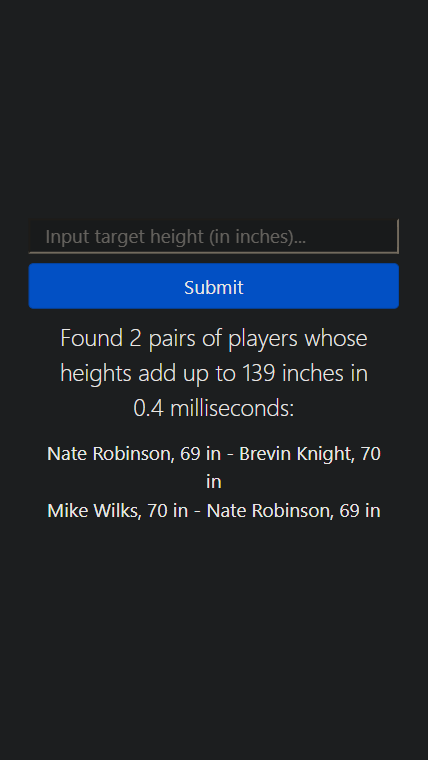
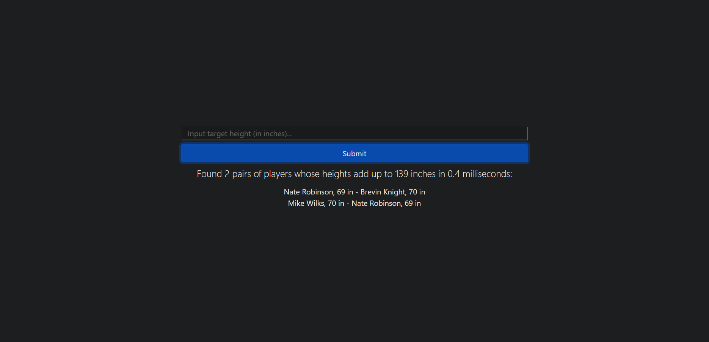

# NBA Players' Heights

The task is to create an application that takes a single integer input. The application will download the raw data from [this API](https://mach-eight.uc.r.appspot.com) and print a list of all pairs of players whose height in inches adds up to the integer input to the application. If no matches are found, the application will print "No matches found". The algorithm to find the pairs has a time complexity of O(n) and a space complexity of O(n). All edge cases are handled appropriately. Unit tests are implemented using Jest. This application is built with JavaScript, React, Redux, and Bootstrap.

## Mobile

## Desktop

## Live Demo

[Live Demo Link](https://dicodiaz.me/nba-players-heights/)

## Built With

- React
- Redux
- Jest
- Bootstrap
- VSCode
- Git & GitHub

## Getting Started

To get this project up and running, follow these simple steps:

1. Clone the repository into your machine (Or download the .zip file and extract).
2. Open the project's folder.
3. Copy and paste all files and folders except app_screenshot.png, app_screenshot-2.png, MIT.md, and README.md into the other project's root folder.
4. Run `npm install`
5. Run `npm start`

### Setup

Follow the steps described before.

## Authors

👤 **Dico Diaz Dussan**

- GitHub: [@dicodiaz](https://github.com/dicodiaz)
- LinkedIn: [Dico Diaz Dussan](https://www.linkedin.com/in/dico-diaz-dussan/)
- Portfolio: [dicodiaz.com.co](https://dicodiaz.com.co)

## 🤝 Contributing

Contributions, issues, and feature requests are welcome!

Feel free to check the [issues page](../../issues/).

## Show your support

Give a ⭐️ if you like this project!

## 📝 License

This project is [MIT](./MIT.md) licensed.
